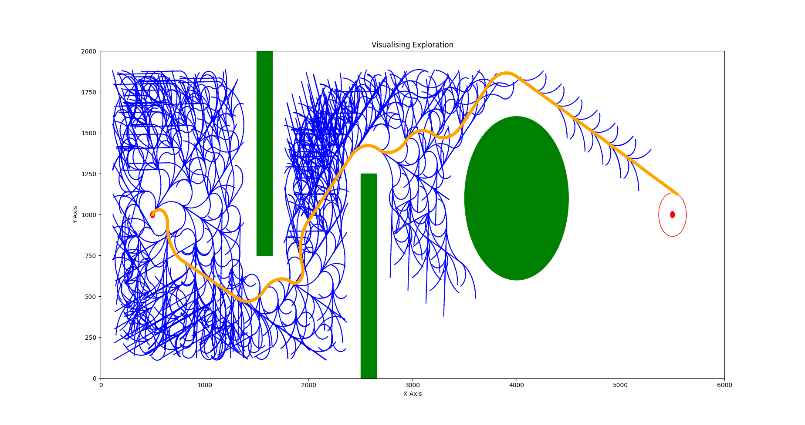

# Project - 3 | Phase - 2
```
Course  : ENPM661 - Planning
github link : https://github.com/sshah115/A-star-turtlebot.git
```
Team: 

|Name|UID|Directory ID|
|:---:|:---:|:---:|
|Shail Shah|119340547|sshah115|
|Krishna Hundekari|119239049|krishnah|

# 1 A* Algorithm
Implementation of the A* algorithm on a Differential
Drive (non-holonomic) TurtleBot3 robot

# Part - 1 | 2D Implementation

Traverse through map from user defined start node to goal node using path computed using A* algorithm along with backtracking and visualization wrt given origin.

# Python File 
```
It is stored in the directory proj3p2_shail_krishna.zip/ part01/proj3p2_shail_krishna.py
```
# Running the code
There are four ways of running a python script which are as follows:

 - You may run it in your operating system's terminal. For e.g., In windows - cmd.
 - Python interactive mode.
 - Integrated Development Environment (IDE) like VSC.
 - Opening the script file from folder

First check the version of python installed in your system by running following command:

*python --version*

If it yields result like this one:

*Python 3.8.10*

Then you may run script in terminal by typing following line in the directory it is located at:

*python3 proj3p2_shail_krishna.py*

# Dependencies

import following modules/library for the script to run correctly: 

*import  numpy as np*  			

*import cv2 as cv*  								

*from queue import PriorityQueue*  

*import math as math*

*from math import dist*

*import matplotlib.pyplot as plt*

*import time*  	

*import copy*

*import matplotlib.patches as patch*

# User input

Defining user defined following attributes in below described format:
```
Enter obstacle clearance:
```
Here user has to enter value to be bloated around obstacles [mm].

```
Note: Make sure the obstacle clearance doesn't add up to block the right end of the map since it will keep on computing childrens through action set.

All user inputs are in 'mm'.
```

```
Hey!! Where to start? Please enter home 'x' coordinate:
```
Here user has to enter value of home position's x coordinate as per new origin defined in project documentation [mm].

Similarly, user has to provide complete home pose i.e., x, y & orientation (Theta in degrees) and for goal pose i.e., just x & y to move foraward.

Next, the user will be prompted with following last two inputs:
```
Enter first possible RPM for the wheel: 
```

```
Enter second possible RPM  for the wheel: : 
```
Here wheel RPMs needs to be defined which will decide the action step in 8 different directions as follows:
```
[0, RPM1]
[RPM1, 0]
[RPM1, RPM1]
[0, RPM2]
[RPM2, 0]
[RPM2, RPM2]
[RPM1, RPM2]
[RPM2, RPM1]
```

Reasonable threshold of 100 mm for checking duplicates is defined in code for faster computation and cleaner output.

Kindly provide the input from your terminal and in the format it is explained above for correct implementation

The output visualization will be generated with shortest path backtracked.

# Result

## Image

**Sample-1**

```
User Input:

Enter obstacle clearance: 5

Hey!! Where to start? Please enter home 'x' coordinate:  
0

Please enter home 'y' coordinate: 
0

Give home orientation:  
45

~~~~~~~~~~~~~~~~~~~~~~~~~~~~~~~~~~~~~~~~~~~~~~~~~~~~~~~~~~~~~~~~~~~~~~~~~~~~~~~~~~~~~~~~~~~~~~~~~~~~~~~


Now give the goal 'x' coordinate 
5000

Now give the goal 'y' coordinate 
0

Enter first possible RPM for the wheel: 
50

~~~~~~~~~~~~~~~~~~~~~~~~~~~~~~~~~~~~~~~~~~~~~~~~~~~~~~~~~~~~~~~~~~~~~~~~~~~~~~~~~~~~~~~~~~~~~~~~~~~~~~~


Enter second possible RPM  for the wheel: 
100

```



Link - https://drive.google.com/file/d/17zA9r4riFEGEpR7f4vnp2Nvpdi7I5zVY/view?usp=sharing

### Terminal output

```
Time needed for the algorithm: 6.29194974899292

The goal is 133.1898307750105 mm away from last explored node
```

## Video

**Sample-1**

```
User Input:

Enter obstacle clearance: 5

Hey!! Where to start? Please enter home 'x' coordinate:  
0

Please enter home 'y' coordinate: 
0

Give home orientation:  
45

~~~~~~~~~~~~~~~~~~~~~~~~~~~~~~~~~~~~~~~~~~~~~~~~~~~~~~~~~~~~~~~~~~~~~~~~~~~~~~~~~~~~~~~~~~~~~~~~~~~~~~~


Now give the goal 'x' coordinate 
5000

Now give the goal 'y' coordinate 
-500

Enter first possible RPM for the wheel: 
50

~~~~~~~~~~~~~~~~~~~~~~~~~~~~~~~~~~~~~~~~~~~~~~~~~~~~~~~~~~~~~~~~~~~~~~~~~~~~~~~~~~~~~~~~~~~~~~~~~~~~~~~


Enter second possible RPM  for the wheel: 
100

```

### Terminal output

```
Time needed for the algorithm: 8.553640604019165

The goal is 307.6223535049164 mm away from last explored node
```
Note: Goal check ensures that it outputs result if it finds a node in proximity of 500 mm of goal node.

### Video link

Link - https://drive.google.com/file/d/1QfEw6fNUKxQJLlbMZVpA41v1-FQ5Mog8/view?usp=sharing

# Part - 2 | Gazebo Visualization

Simulate the path planning implementation on Gazebo with the TurtleBot 3 Burger robot.

## ROS Package

Download the zip file ```proj3p2_shail_krishna.zip```

ROS package folder has been included in the zip file at following path:

```
It is stored in the directory proj3p2_shail_krishna.zip / proj3
```

This ROS package can be directly copied to ```src``` folder of catkin_ws if it is already setup. If not, a catkin_ws needs to be setup.

Then build the catkin workspace so that it can integrate the package:

```
$ cd ~/catkin_ws && catkin_make
```

Now, as suggested everything has been wrapped in only one launch file i.e., gazebo initialization, turtlebot spawning to origin defined in map and moving to goal pose. This can be initiated using following command"

```
$ roslaunch proj3 proj3.launch
```

The above launch will run two nodes:

1. Gazebo_ros node that spawns the turtlebot so make sure turtlebot and gazebo ros packages are correctly installed in your system.
2. Python script with publisher to send commands and subscriber to get odom orientation data for reorienting the bot for reaching to goal accurately.

It runs for following defined parameters:

```
User Input:

Enter obstacle clearance: 5

Hey!! Where to start? Please enter home 'x' coordinate:  
0

Please enter home 'y' coordinate: 
0

Give home orientation:  
45

~~~~~~~~~~~~~~~~~~~~~~~~~~~~~~~~~~~~~~~~~~~~~~~~~~~~~~~~~~~~~~~~~~~~~~~~~~~~~~~~~~~~~~~~~~~~~~~~~~~~~~~


Now give the goal 'x' coordinate 
5000

Now give the goal 'y' coordinate 
0

Enter first possible RPM for the wheel: 
50

~~~~~~~~~~~~~~~~~~~~~~~~~~~~~~~~~~~~~~~~~~~~~~~~~~~~~~~~~~~~~~~~~~~~~~~~~~~~~~~~~~~~~~~~~~~~~~~~~~~~~~~


Enter second possible RPM  for the wheel: 
100

```

This will show the turtlebot moving in the map.world from (0,0) to (5000, 0)

**Optional**

It can run by rosrun command too by following command:

```
$ rosrun proj3 test.py
```

rosrun ensures that the node stops and the turtlebot stops at target location. roslaunch might respawn the node. respawn='false' and required='true' are inculcated and tried but it respawns, however, it reaches the goal node.

### Video link

Link - https://drive.google.com/file/d/19t6n0q_grLAJKlRcP5fGCxVoC1qBrdqF/view?usp=sharing
